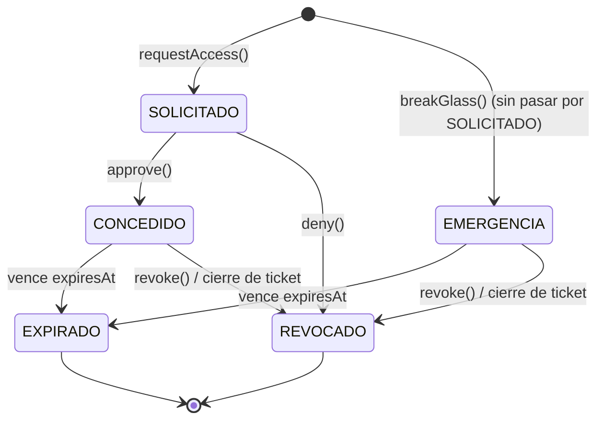

# Control de acceso de soporte con consentimiento

## Índice

1. [Propósito](#propósito)
2. [Modelo de datos](#modelo-de-datos)
3. [Máquina de estados](#máquina-de-estados)
4. [Modelo de alcance (OPERATIVO / DATOS_PERSONALES)](#modelo-de-alcance-operativo--datos_personales)
5. [Aislamiento por ticket](#aislamiento-por-ticket)
6. [Flujo de solicitud y aprobación](#flujo-de-solicitud-y-aprobación)
7. [Techo de duración](#techo-de-duración)
8. [Break-glass (acceso de emergencia)](#break-glass-acceso-de-emergencia)
9. [Rutas de expiración y revocación](#rutas-de-expiración-y-revocación)
10. [`refresh()` cerrado](#refresh-cerrado)
11. [Notificación en tiempo real](#notificación-en-tiempo-real)
12. [Bitácora: catálogo de eventos](#bitácora-catálogo-de-eventos)
13. [Cómo el colegio consulta la bitácora](#cómo-el-colegio-consulta-la-bitácora)
14. [Guards de alcance y bypass de `SUPER_ADMIN`](#guards-de-alcance-y-bypass-de-super_admin)
15. [Fuera de alcance](#fuera-de-alcance)

## Propósito

Reemplaza la impersonación directa (un supervisor entraba a cualquier colegio sin
pedir permiso ni dejar más rastro que un log de auditoría) por un flujo de
**consentimiento explícito, con alcance acotado y expiración**: un agente de
soporte pide acceso a un ticket concreto, un supervisor lo aprueba con un
alcance y una duración, y ese acceso se revoca solo — por tiempo, por cierre
del ticket, o a mano — sin depender de que nadie se acuerde de cerrarlo.

## Modelo de datos

`AccessSession` (`packages/database/prisma/schema.prisma`):

| Campo | Tipo | Notas |
|---|---|---|
| `ticketId` | `String` (FK `SupportTicket`, NOT NULL) | Todo acceso está atado a un ticket — es la justificación y la unidad de aislamiento. |
| `tenantId` | `String` (FK `Tenant`) | Denormalizado del ticket, para no tener que resolverlo en cada guard. |
| `requestedById` | `String` (FK `User`) | El agente/supervisor que pidió (o se auto-concedió, en break-glass) el acceso. |
| `approvedById` | `String?` (FK `User`) | Quién aprobó, negó o revocó. En break-glass, el mismo que `requestedById`. |
| `scope` | `AccessScope` | `OPERATIVO` \| `DATOS_PERSONALES`. |
| `status` | `AccessSessionStatus` | Ver [máquina de estados](#máquina-de-estados). |
| `reason` | `String` | Motivo declarado al pedir el acceso. |
| `requestedDurationMinutes` | `Int` | Duración pedida; el aprobador puede ajustarla al aprobar. |
| `grantedAt` / `expiresAt` | `DateTime?` | Se fijan al aprobar/conceder; `expiresAt` es la ventana real. |
| `revokedAt` / `revokedReason` / `denialReason` | — | Distintas ramas de cierre. |

`Tenant.maxAccessDurationMinutes` (`Int?`, nullable): techo propio del colegio
sobre cuánto puede durar un acceso concedido — ver [Techo de duración](#techo-de-duración).

`AuthSession.ticketId` (`String?`, nullable): el ticket que justificó una
impersonación, embebido también en el JWT (`AuthTokenPayload.ticketId`) —
ver [Aislamiento por ticket](#aislamiento-por-ticket).

## Máquina de estados

`SOLICITADO`, `CONCEDIDO`, `EXPIRADO`, `REVOCADO` y `EMERGENCIA` son estados
terminales salvo `SOLICITADO` (que resuelve a `CONCEDIDO` o `REVOCADO`) y
`CONCEDIDO`/`EMERGENCIA` (que resuelven a `EXPIRADO` o `REVOCADO`). Ninguna
transición vuelve hacia atrás.

## Modelo de alcance (OPERATIVO / DATOS_PERSONALES)

Dos niveles, con `DATOS_PERSONALES` cubriendo también lo que exige
`OPERATIVO` (no al revés). Clasificación por módulo aplicada vía `@DataScope`:

| Alcance | Módulos |
|---|---|
| **OPERATIVO** | `tenants`, `settings`, `academic`, `groups`, `subjects`, `schedules`, `announcements`, `notifications`, `audit` |
| **DATOS_PERSONALES** | `students`, `marks`, `attendance`, `guardians`, `conversations`, `documents`, `teachers`, `payments`, `elections`, `homework-submissions`, `quiz-attempts`, `users` |
| **Por payload (no por ruta)** | `reports` (según `type` del body: `COURSES` → OPERATIVO, el resto → DATOS_PERSONALES); `files` (según a qué entidad resuelve el `fileKey` — ver tabla en `files-data-scope.guard.ts`; fallback conservador a DATOS_PERSONALES si no resuelve) |

Los guards viven en `apps/api/src/common/guards/data-scope.guard.ts`
(genérico, lee el decorador `@DataScope`), y dos especializados por payload:
`apps/api/src/modules/reports/reports-data-scope.guard.ts` y
`apps/api/src/modules/files/files-data-scope.guard.ts`.

## Aislamiento por ticket

El alcance no se resuelve por `(agente, colegio)` sino por
`(agente, ticketId, colegio)`: dos sesiones activas del mismo agente sobre el
mismo colegio, una por ticket A y otra por ticket B, no se mezclan — cada una
solo habilita leer datos citando SU ticket.

Mecanismo: `POST /auth/impersonate` ahora exige `ticketId` en el body (antes
solo `tenantId`), valida que el ticket pertenezca al colegio, y solo emite el
JWT si existe una `AccessSession` `CONCEDIDO`/`EMERGENCIA` para
`(agente, ESE ticket, colegio)`. El `ticketId` queda embebido en el JWT
(`AuthTokenPayload.ticketId`) y persistido en `AuthSession.ticketId` para que
sobreviva a cada `refresh()`. Los tres guards de alcance
(`DataScopeGuard`/`ReportsDataScopeGuard`/`FilesDataScopeGuard`) fallan
cerrado (403) si un JWT impersonado no trae `ticketId`.

## Flujo de solicitud y aprobación

1. Agente: `POST /access-sessions` (`ticketId`, `scope`, `reason`, duración
   pedida). Requiere que el ticket esté abierto.
2. Supervisor: `PATCH /access-sessions/:id/approve`, con `durationMinutes`
   opcional para ajustar la duración pedida — nunca puede exceder el techo
   efectivo (ver siguiente sección). Al aprobar se programa el
   [job diferido](#rutas-de-expiración-y-revocación) de expiración.
3. Supervisor: `PATCH /access-sessions/:id/deny` con `reason`, en vez de
   aprobar.
4. Agente/supervisor con el acceso `CONCEDIDO`: `POST /auth/impersonate`
   citando el mismo `ticketId` → JWT de impersonación aislado a ese ticket.

## Techo de duración

`MAX_ACCESS_DURATION_MINUTES = 480` (8h) es el techo absoluto del sistema
(`access-control.schemas.ts`). Cada colegio puede fijar un techo propio, más
estricto, en `Tenant.maxAccessDurationMinutes` — nunca puede guardarse por
encima del absoluto (`updateTenantSchema` lo valida en backend). Al aprobar,
`AccessControlService#approve` calcula el techo efectivo
(`tenant.maxAccessDurationMinutes ?? MAX_ACCESS_DURATION_MINUTES`) y
**rechaza** (400, no recorta en silencio) si la duración concedida lo excede.
Editable por el propio colegio en `/admin/configuracion` → pestaña
"Institución" → "Acceso de soporte".

## Break-glass (acceso de emergencia)

`POST /access-sessions/break-glass`: un supervisor se auto-concede acceso
inmediato (`EMERGENCIA`, salta `SOLICITADO`), sin que nadie más apruebe.
Compensado con: ventana corta (máximo 120 min), motivo obligatorio más largo
(mínimo 15 caracteres), y una notificación in-app/email inmediata a
`TENANT_ADMIN`/`PRINCIPAL` del colegio (`NotificationEventType.SUPPORT_ACCESS_EMERGENCY`).
La auditoría (`support.access.emergency_granted`) es la única salvaguarda real
aquí — no hay aprobación previa que revisar.

## Rutas de expiración y revocación

Cuatro caminos, todos convergiendo en un único punto de escritura para evitar
carreras y duplicar eventos:

- **`transitionAccessSession()`** (privado): compare-and-swap — el `UPDATE`
  incluye el `status` que se leyó, así que si otra ruta ya transicionó la fila
  entre la lectura y el intento, la operación no afecta ninguna fila y el
  caller sabe que perdió la carrera.
- **`expireSessionById()`**: único punto que expira una sesión con todos sus
  efectos — transición a `EXPIRADO`, revocación de las `AuthSession` de
  impersonación asociadas, auditoría `support.access.expired`, evento en
  tiempo real, y limpieza del job diferido si quedó huérfano.

Caminos que consumen lo anterior:

1. **Job diferido por sesión**: al aprobar/conceder, se encola en BullMQ
   (`ACCESS_SESSION_EXPIRY_QUEUE`) un job `expire-one` con
   `delay = expiresAt - now`. Dispara justo a tiempo (desfase verificado
   menor a 1 segundo). Se cancela si la sesión llega a un estado terminal
   antes (revocación).
2. **Barrido periódico**: cada `EXPIRY_SWEEP_INTERVAL_MS` (60s), un job
   repetible `sweep` busca toda `CONCEDIDO`/`EMERGENCIA` vencida y la procesa
   vía `expireSessionById`. Es la red de seguridad para lo que el job
   diferido se pierda (caída del proceso, Redis reiniciado).
3. **Resolución perezosa** (`resolveExpiration`): al leer una sesión
   (`GET /access-sessions/active`, listados), si ya venció pero sigue
   marcada activa, se expira al vuelo. Red de seguridad final — nunca deja
   que un `GET` muestre como activa una sesión vencida, incluso si los dos
   caminos anteriores todavía no la alcanzaron.
4. **Revocación manual** (`revoke()`) y **por cierre de ticket**
   (`revokeAllForTicket()`, disparado por el evento `support.ticket.updated`
   cuando el ticket pasa a `RESOLVED`/`CLOSED`): ambos usan
   `transitionAccessSession()` y devuelven/registran solo si ganaron la
   transición. `revoke()` responde `409 Conflict` si la sesión ya no estaba
   activa cuando se intentó revocar.

Ninguna de las cuatro rutas escribe `status` directamente fuera de
`transitionAccessSession()`/`expireSessionById()` (excepto `requestAccess`/
`approve`/`deny`, que parten de `SOLICITADO` sin escritor concurrente
posible).

## `refresh()` cerrado

`POST /auth/refresh` reevalúa `hasActiveScopeForTicket()` antes de reemitir un
JWT impersonado. Si la `AccessSession` del ticket embebido ya no está activa
(revocada, expirada), el refresh se rechaza con `401`, se revoca la
`AuthSession` asociada, y se registra `auth.refresh_denied`. Sin esto, un
agente con un refresh token todavía vigente (hasta 30 días) podía seguir
reemitiendo JWTs de impersonación después de que su acceso fuera revocado —
los datos seguían protegidos por los guards de alcance, pero la sesión de
impersonación en sí nunca moría. El refresh de sesiones **no** impersonadas
no se tocó — sigue exactamente igual que antes de todo este trabajo.

## Notificación en tiempo real

`expireSessionById()` emite `support.access.expired` vía `EventEmitter2`;
`SupportGateway` (namespace `/support`, ya existente para el chat) lo reenvía
al room `ticket:${ticketId}` — el mismo room que ya usa el chat del ticket, sin
ampliar el modelo de rooms. `apps/web/app/admin/layout.tsx` se une a ese room
mientras está impersonando y, al recibir el evento, sale de la impersonación
automáticamente en vez de esperar a que el próximo request choque contra un
guard.

## Bitácora: catálogo de eventos

Todos vía el `AuditService` ya existente (append-only, sin update/delete).

| Acción | Disparador | `entityType` |
|---|---|---|
| `support.access.requested` | Agente pide acceso | `AccessSession` |
| `support.access.approved` | Supervisor aprueba | `AccessSession` |
| `support.access.denied` | Supervisor niega | `AccessSession` |
| `support.access.revoked` | Revocación manual o por cierre de ticket | `AccessSession` |
| `support.access.emergency_granted` | Break-glass | `AccessSession` |
| `support.access.expired` | Cualquiera de las 3 rutas de expiración, la que gane | `AccessSession` |
| `auth.impersonate` | JWT de impersonación emitido | `Tenant` |
| `auth.impersonate_ended` | Salida manual de la impersonación | `AuthSession` |
| `auth.refresh_denied` | Refresh rechazado por acceso inactivo | `AuthSession` |
| `files.scope_fallback` | `fileKey` no resuelve a ninguna entidad dueña conocida | `File` |

## Cómo el colegio consulta la bitácora

`GET /audit/logs` (`apps/api/src/modules/audit/`), ya existente, acotado por
tenant para roles no-plataforma. El frontend del colegio lo consume en
`/admin/actividad` (`apps/web/app/admin/actividad/page.tsx`) — no se construyó
ninguna vista nueva, los eventos de este sistema aparecen ahí automáticamente
con etiquetas humanizadas (`apps/web/components/shared/audit-labels.ts`).

## Guards de alcance y bypass de `SUPER_ADMIN`

Los guards de alcance (`DataScopeGuard` y los dos especializados por payload)
son **aditivos** a `PermissionsGuard`, nunca lo reemplazan, y solo actúan
cuando `user.isImpersonated === true`. El bypass incondicional de
`SUPER_ADMIN` en `PermissionsGuard` no se tocó en ningún punto de este
trabajo — un `SUPER_ADMIN` en su propia sesión (no impersonando) nunca pasa
por un guard de alcance.

## Fuera de alcance

Ver [`docs/backlog/riesgo-residual-acceso.md`](../backlog/riesgo-residual-acceso.md)
para las brechas conocidas y aceptadas conscientemente, con su condición de
reactivación.
