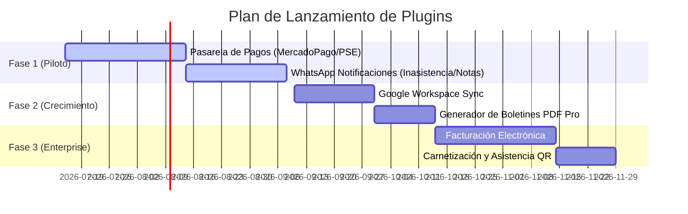

# Plan de Integraciones y Plugins (Estrategia SaaS) — Classia

Este documento detalla el catálogo de plugins e integraciones planificadas para Classia SaaS, diseñadas específicamente para el mercado de colegios en **Sudamérica**. Al ser un SaaS multi-tenant, todas las integraciones se manejan lógicamente (Feature Flags / Configuración aislada) compartiendo el mismo despliegue centralizado.

---

## 1. Arquitectura de Plugins en Multi-Tenant

Para garantizar la estabilidad y la seguridad del sistema global, Classia **no permite cargar código de terceros en caliente** (a diferencia de Moodle o WordPress). En su lugar, el soporte de plugins se divide en tres niveles técnicos:

1. **Banderas de Características (Feature Flags):** El código del plugin ya viene compilado dentro de NestJS y Next.js. El SuperAdmin habilita el módulo para el `tenant_id` correspondiente en la base de datos.
2. **Credenciales Parametrizadas:** Cada colegio configura sus propios tokens de acceso y llaves API encriptadas desde su panel administrativo (ej. credenciales de MercadoPago o Google Workspace).
3. **Webhooks y API Keys:** Integraciones avanzadas con hardware físico o software a medida se conectan por fuera a través de eventos en segundo plano enviados por la cola de tareas (BullMQ).

---

## 2. Catálogo de Plugins Propuestos

### Módulo A: Comunicación y Alertas (Engagement Familiar)

#### 1. Notificaciones por WhatsApp Business API
* **Propósito:** Enviar alertas de inasistencia, reportes de comportamiento y recordatorios de tareas al WhatsApp del padre.
* **Integración:** Proveedores autorizados (Waba local o Twilio API).
* **Monetización:** Cobro por volumen de mensajes enviados (ej. recargas de paquetes de mensajes).

#### 2. SMS Gateway de Emergencia
* **Propósito:** Envíos rápidos para padres en zonas sin cobertura de internet móvil constante.
* **Integración:** Twilio o pasarelas de SMS locales de LatAm (ej. Háblame, Celuweb).

---

### Módulo B: Fintech y Recaudo (Dolor Administrativo)

#### 1. Pasarela de Pagos (Pensión y Matrícula)
* **Propósito:** Permitir el pago mensual de pensiones directamente desde el portal móvil/web.
* **Integración:** MercadoPago (LatAm), PayU, Bold o PSE (específico para Colombia).
* **Monetización:** Comisión porcentual sobre cada transacción procesada o cobro mensual fijo.

#### 2. Facturación Electrónica Automatizada
* **Propósito:** Emitir facturas con validez legal automáticamente al procesar el pago de pensión.
* **Integración:** Proveedores tecnológicos autorizados (ej. Siigo en Colombia, SUNAT Factores en Perú).

---

### Módulo C: Sincronización y Suites de Aprendizaje (LMS)

#### 1. Google Workspace for Education Sync
* **Propósito:** Creación masiva de cuentas de correo institucionales (`@colegio.edu`) y sincronización automática de grupos, tareas y calificaciones con **Google Classroom**.
* **Integración:** Google APIs OAuth 2.0 por Tenant.

#### 2. Microsoft Teams for Education Sync
* **Propósito:** Sincronización idéntica para colegios que operan bajo la suite educativa de Microsoft 365.
* **Integración:** Microsoft Graph API.

#### 3. Conector Genérico Moodle (LMS)
* **Propósito:** Jalar notas y tareas de un Moodle existente para procesarlas en el boletín final consolidado de Classia.
* **Integración:** Moodle REST Web Services.

#### 4. Compilador LaTeX Completo (estilo Overleaf) — futuro, sin priorizar aún
* **Propósito:** Permitir a un profesor redactar un examen/documento completo en LaTeX real (con `\usepackage`, diagramas TikZ, bibliografía, numeración de páginas, `\ref`/`\label`) y compilarlo a PDF dentro de la plataforma — un salto cualitativo distinto de renderizar fórmulas sueltas, que es lo que hace KaTeX hoy en preguntas/tareas.
* **Integración:** Requiere un motor de compilación real (`pdflatex`/`xelatex`/`tectonic`) corriendo en un contenedor aislado y efímero (sandboxing obligatorio, ya que el usuario sube código arbitrario) — candidato a microservicio separado o a un servicio gestionado tipo Overleaf/LaTeX-on-demand vía API, no una librería cliente como KaTeX.
* **Nota:** No confundir con el soporte de fórmulas matemáticas actual. `apps/web/components/shared/math-text.tsx` ya usa KaTeX con sintaxis 100% estándar de LaTeX (`$...$`, `$$...$$`, `\(...\)`, `\[...\]`) para expresiones aisladas dentro de texto — eso no requiere ningún cambio. Este plugin cubriría el caso de uso distinto y mucho más grande de compilar documentos completos, no fórmulas embebidas.

---

### Módulo D: Control de Acceso y Hardware (Operativo)

#### 1. Asistencia por Carnet Digital / Código QR
* **Propósito:** Un panel web exclusivo en la entrada de la escuela. El estudiante pasa su carnet (QR o código de barras) y el sistema marca asistencia automáticamente, disparando un WhatsApp al acudiente.
* **Integración:** NestJS WebSocket Gateway + Lector USB emulador de teclado en portería.

#### 2. Lector Biométrico de Asistencia (RFID/Huella)
* **Propósito:** Control de entrada y salida para personal docente y administrativo.
* **Integración:** Webhook receptor desde el software local de administración del biométrico.

---

## 3. Hoja de Ruta de Desarrollo e Integración

Para validar comercialmente la plataforma, la prioridad de desarrollo de plugins se divide en tres fases:

